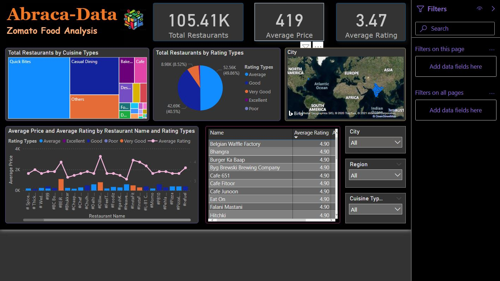

# Zomato-Food-Analysis
The **Zomato Food Analysis** project aims to provide an analysis of Zomato Food Datasets(Hotels of Different cities of India). In this repo, you'll find a precise and interactive Power BI report and the website built using Django. You can have a look at the website [here](https://zomato.pythonanywhere.com/). [This](https://www.youtube.com/watch?v=A6mTN6G-adM&t=307s) is the reference for Hosting tutorial.  

## Datasets
We've got the datasets in the raw form as you can see [here](Datasets/Raw-Datasets) where we have the different folder for each cities(total around 80 cities) and the hotel details in `.csv` files for each cities, see [this](Datasets/Raw-Datasets/Ahmedabad) for reference.

 ### Data Pre-processing
As you can see in [this](Datasets/Raw-Datasets/Ahmedabad/1-Ahmedabadhotels.csv) file, the delimiter is `|` and thus *NAME*, *PRICE* ... *VOTES* are all the different columns. Out of all these columns, We've removed the unnecessary columns like *URL*, *TIMIING*, *PAGE NO*, *VOTES* as per our use case, change the delimiter from `|` to `,` and merged all the files of particular city into one file. For ex. All [these](Datasets/Raw-Datasets/Ahmedabad) files contents are now in the one single file i.e. **`Ahmedabad.csv`**. We've done this for all the cities.  

As you can see in [this](Datasets/Raw-Datasets/Ajmer/18-Ajmerhotels.csv) file, columns like *RATING*, *RATING_TYPE* contains some values like `None`, `Opening`, `NEW`, `Not rated` etc. Thus, we've handle this values and finally merged all the files of each cities into one single file. See [this](/Datasets/Processed-Datasets/Cities.csv) reference file. Note that I've include only two cities data in the reference file.
 
 ## Power-BI Report
 We have added different graphs, cards, tables, filters, etc. You can have a look at the interactive Power-BI report [here](https://app.powerbi.com/view?r=eyJrIjoiZmI4YzZlMDktNjg4ZS00MzJiLTllOWUtMzNkOGYzNWI3ZjdmIiwidCI6ImMxM2U1MTgxLTlkMTItNDIwYS04MmNjLTBkMWRlODU2ZDY2YiJ9) and try different filters as per your need. Feel free to try different cities, regions and cuisine types.

In case if above link isn't accessible, I am attaching the following snap-shot for reference.

## Website
We've developed a simple website using Django and hosted it using [pythonanywhere](https://www.pythonanywhere.com). You can have a look at our website [here](https://zomato.pythonanywhere.com/).
